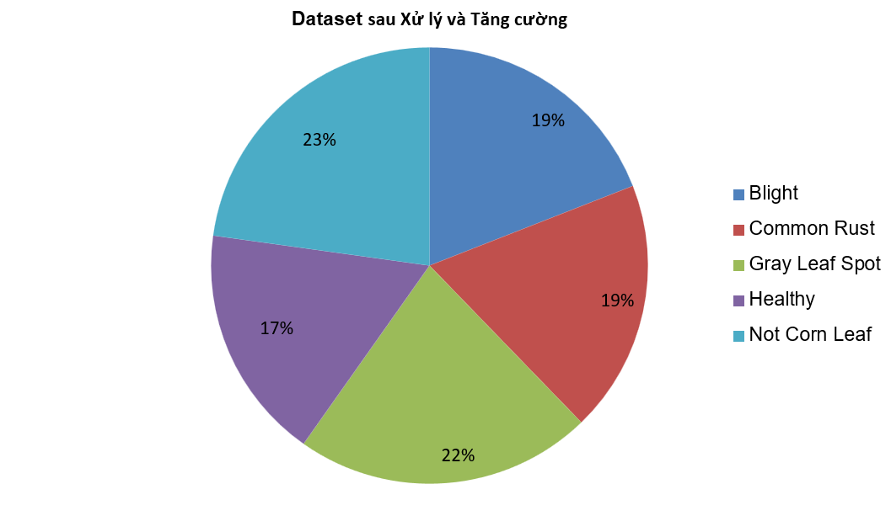
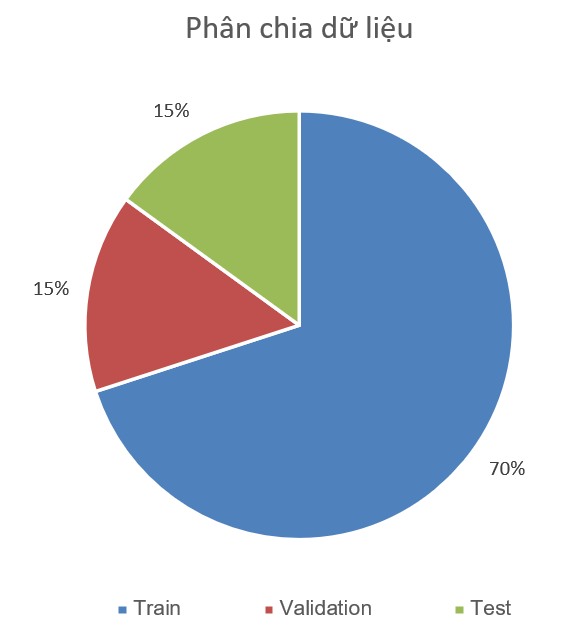
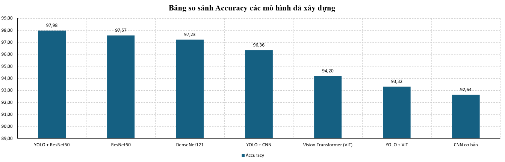
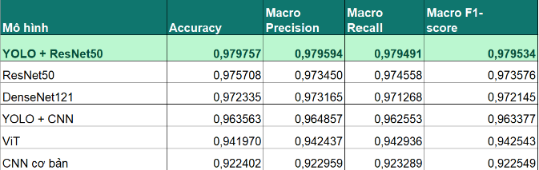

# 🌽 Corn Leaf Disease Classification

  

Một hệ thống phân loại bệnh trên lá ngô sử dụng Deep Learning. Dự án cung cấp một ứng dụng web hoàn chỉnh với giao diện thân thiện (React + Vite) và API mạnh mẽ (FastAPI + TensorFlow), giúp người dùng tải ảnh lên và nhận diện bệnh với độ chính xác cao.

## ✨ Tính năng chính

- **Tải ảnh và xem trước:** Giao diện kéo thả hoặc chọn ảnh trực quan.
- **Dự đoán bệnh tự động:** Nhận diện 4 loại bệnh phổ biến và trạng thái khỏe mạnh trên lá ngô.
- **Trực quan hóa kết quả:** Hiển thị độ tin cậy (confidence score) và phân phối xác suất cho tất cả các lớp.
- **Thông tin chi tiết:** Cung cấp mô tả tổng quan về loại bệnh được dự đoán.

## 🛠️ Công nghệ sử dụng

- **Frontend:** React, Vite, Tailwind CSS
- **Backend:** FastAPI, Python, Uvicorn
- **AI / Deep Learning:** TensorFlow / Keras, YOLO, Vision Transformer (ViT)

## 📁 Cấu trúc dự án

```text
DA07_Deeplearning/
├── Source_code/
│   ├── backend/    # Mã nguồn API Server (FastAPI)
│   └── frontend/   # Mã nguồn giao diện web (React + Vite)
├── Model/          # Chứa các model đã được huấn luyện (.keras, .pt)
├── Dataset/        # Dữ liệu ảnh sử dụng cho huấn luyện và kiểm thử
├── notebook_code.py# Script/notebook huấn luyện mô hình
└── README.md       # Tài liệu dự án 
```

## 🚀 Hướng dẫn Cài đặt & Chạy Dự án

Để chạy ứng dụng, bạn cần cài đặt và khởi động song song cả **Backend** và **Frontend**.

### Yêu cầu hệ thống
- **Python** 3.8+
- **Node.js** 16+
- **Git**

---

### 1. Clone dự án

Mở terminal và thực thi lệnh sau để tải mã nguồn về máy:

```bash
git clone https://github.com/klongnguyen/DA7_DeepLearning.git
cd DA07_Deeplearning-master
```

### 2. Thiết lập và Chạy Backend (API Server)

Backend xử lý logic AI và trả về kết quả dự đoán khi nhận được yêu cầu từ Frontend.

**Bước 1:** Di chuyển vào thư mục backend
```bash
cd Source_code/backend
```

**Bước 2:** Khởi tạo môi trường ảo (Virtual Environment)
```bash
# Trên Windows
python -m venv venv
venv\Scripts\activate

# Trên macOS/Linux
python3 -m venv venv
source venv/bin/activate
```

**Bước 3:** Cài đặt các gói thư viện Python yêu cầu
```bash
pip install -r requirements.txt
```

**Bước 4:** Khởi động FastAPI server
```bash
uvicorn main:app --reload
```
*Lưu ý: Hãy đợi đến khi terminal hiển thị thông báo `INFO: Application startup complete.` trước khi chuyển sang chạy Frontend.*

---

### 3. Thiết lập và Chạy Frontend (Giao diện Web)

Mở một **terminal mới** (vẫn giữ nguyên terminal backend đang chạy) để cài đặt và khởi động giao diện.

**Bước 1:** Di chuyển vào thư mục frontend
```bash
cd Source_code/frontend
```

**Bước 2:** Cài đặt các gói thư viện Node.js yêu cầu
```bash
npm install
```

**Bước 3:** Khởi động Development Server
```bash
npm run dev
```

Sau khi khởi chạy thành công, terminal sẽ cung cấp một đường link (ví dụ: `http://localhost:5173`). Bạn có thể giữ `Ctrl` + Click (hoặc `Cmd` + Click trên macOS) vào đường link đó để truy cập ứng dụng trên trình duyệt web.

## 📊 Thông tin Phân loại (Classes)

Dự án hỗ trợ nhận diện và phân loại 5 lớp hình ảnh trên lá ngô. Dưới đây là bảng thống kê số lượng hình ảnh cho từng phân lớp trong tập dữ liệu:

| Lớp (Class) | Mô tả | Số lượng (Images) |
| :--- | :--- | :--- |
| **Blight** | Bệnh đốm lá lớn | 1834 |
| **Common Rust** | Bệnh rỉ sắt | 1802 |
| **Gray Leaf Spot** | Bệnh đốm xám | 2119 |
| **Healthy** | Lá khỏe mạnh bình thường | 1677 |
| **Not Corn Leaf** | Không phải hình ảnh lá ngô | 2195 |
| **Tổng cộng** | | **9627** |

*(Dưới đây là biểu đồ tỷ lệ phân bổ các lớp dữ liệu và tỷ lệ chia tập dữ liệu train/val/test)*

<div align="center">
  
</div>
<div align="center">
  
</div>

## 📈 Kết quả Mô hình (Model Performance)

Dự án đã tiến hành thử nghiệm và so sánh nhiều kiến trúc mạng khác nhau. Dưới đây là biểu đồ so sánh độ chính xác (Accuracy) và bảng chi tiết các độ đo (Metrics) cho các mô hình:

<div align="center">
  
</div>

<br/>

<div align="center">
  
</div>

---
*Dự án 07 Deep Learning - Cập nhật 2026*
